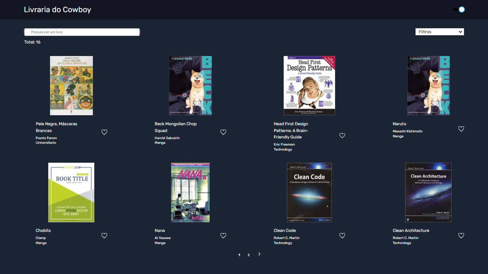

<h2 align="center">
  Tera Code Challenge Front-End
</h2>

<br>

<p align="center">
  <a href="#project">Projeto</a>&nbsp;&nbsp;&nbsp;|&nbsp;&nbsp;&nbsp;
  <a href="#layout">Layout</a>&nbsp;&nbsp;&nbsp;|&nbsp;&nbsp;&nbsp;
  <a href="#technologies">Tecnologias</a>&nbsp;&nbsp;&nbsp;|&nbsp;&nbsp;&nbsp;
  <a href="#execution">Executando</a>&nbsp;&nbsp;&nbsp;|&nbsp;&nbsp;&nbsp;
  <a href="#license">Licença</a>
</p>
<br>

## 💻 Projeto

A livraria Cowboy é um projeto desenvolvido para a **vaga de Front-End Júnior na Somos Tera**.

## 🔖 Layout

Você pode visualizar o layout do projeto através do link abaixo:

<p align="center">
    
</p>

- [Layout Web](https://www.figma.com/file/NOheNk0mgaQkSpiq7i2ppR/Tera-Code-Challenge-FrontEnd?node-id=58%3A11) 

Lembrando que você precisa ter uma conta no [Figma](http://figma.com/).

## 🧪 Tecnologias

Esse projeto foi desenvolvido com as seguintes tecnologias:

- [React](https://reactjs.org)
- [TypeScript](https://www.typescriptlang.org/)

## 🚀 Como executar

Clone o projeto e acesse a pasta do mesmo.
```bash
$ git clone https://github.com/micaelecarv/code-tera-challenge.git
$ cd code-tera-challenge 
```

Para iniciá-lo, siga os passos abaixo:
```bash
# Instalar as dependências
$ yarn

# Iniciar o projeto
$ yarn start
```
A aplicação estará disponível no seu browser pelo endereço http://localhost:3000.

## 📝 License

Esse projeto está sob a licença MIT. Veja o arquivo [LICENSE](LICENSE.md) para mais detalhes.

---

Feito com 🖤 by Micaele Carvalho 👋🏻!
